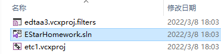
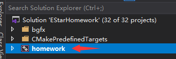
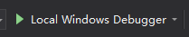
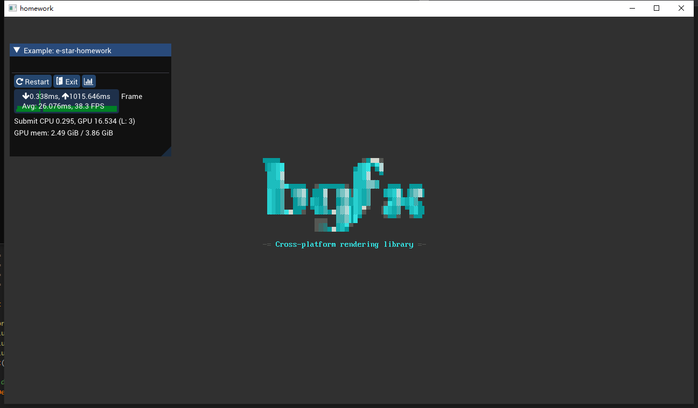

## 前置需求

1. 安装Visual Studio 2022（或2019）
   
   https://visualstudio.microsoft.com/zh-hans/downloads/

2. 安装最新版本CMake

	https://cmake.org/download/

## 如何编译、运行作业框架

!!! warning "特别注意"
	路径中不能含有中文、空格和特殊符号，否则无法正确运行作业框架。

1. 创建**build**目录：

	```powershell
	mkdir build
	```

2. 进入**build**目录，运行**cmake**：

	```powershell
	cd build
	cmake ../
	```

3. 双击**build**目录下的**EStarHomework.sln** ，打开工程：
   
   

4. 将项目**homework**设置为启动项目：
   
   

5. 点击**调试运行**：
   
   

6. 编译结束后，将看见如下窗口，说明成功了！
   
   

## bgfx介绍

作业基于bgfx编写。

bgfx是一个开源的跨平台渲染库，封装了统一的接口，屏蔽了底层不同图形API的差异（DirectX、OpenGL等）。

bgfx文档网站为：<https://bkaradzic.github.io/bgfx/>。在这里可也以看见教程和范例。

### shader编写

bgfx的shader采用了GLSL语法。编写后，需要使用bgfx自制shader编译工具**shaderc**编译，随后才能使用。**shaderc.exe**位于**tools**目录。

关于shader编写和shader编译，详见 bgfx文档：<https://bkaradzic.github.io/bgfx/tools.html#shader-compiler-shaderc>

### 模型与贴图导入

bgfx采用了自定义格式模型与贴图，原始模型和贴图需要经过转换才能使用。

我们提供了一份已转换好的模型与贴图，位于**resource**目录，同学们可以直接使用。其中模型为.bin格式，可以使用**tools/geometryv.exe**打开预览；贴图为.dds格式，可以使用**tools/texturev.exe**打开预览。另外，也可以使用Visual Studio打开.dds贴图查看。

如果希望使用其它模型和贴图，则需要自己进行格式转换。

转换模型的程序为**geometryc.exe**。关于模型转换的文档详见：<https://bkaradzic.github.io/bgfx/tools.html#shader-compiler-shaderc>

转换贴图的程序为**texturec.exe**。关于贴图转换的文档详见：<https://bkaradzic.github.io/bgfx/tools.html#texture-compiler-texturec>

## 作业需求

作业分为5个level。每完成一个level的所有需求，则可继续挑战下一level。若未完成低等级level需求，则无法获取高等级level的分数。

### Level1

1. 加载模型，绘制在屏幕上。
2. 添加环绕相机（Orbit Camera），并可以使用鼠标操控：
	- 鼠标左键拖拽以旋转镜头（类似geometryv里的操作方式）
	- 鼠标滚轮缩放镜头（类似geometryv里的操作方式）

### Level2

1. 为模型添加基础纹理。
2. 为模型添加基础光照（Blinn-Phong）
3. 在保留环绕相机功能的情况下，为相机添加键盘控制：
	- ADWS控制镜头左右上下平移

### Level3

1. 把模型的直接光漫反射光照改为PBR模型实现
    - 模型的金属度能正确影响漫反射光照
    - 模型的albedo（反照率）使用纹理控制
2. 把模型的直接光高光改为PBR模型实现
    - 模型的金属度，粗糙度通过纹理控制

### Level4

1. 使用IBL(Image-Based Lighting)，为模型添加环境光照的漫反射部分
2. 使用IBL(Image-Based Lighting)，为模型添加环境光照的高光反射部分
3. 添加一个包住场景的天空盒
    天空盒使用的cubemap纹理，对应IBL图的mipmap level 0

### Level5

1. 使用ShadowMap的方式，为模型添加阴影