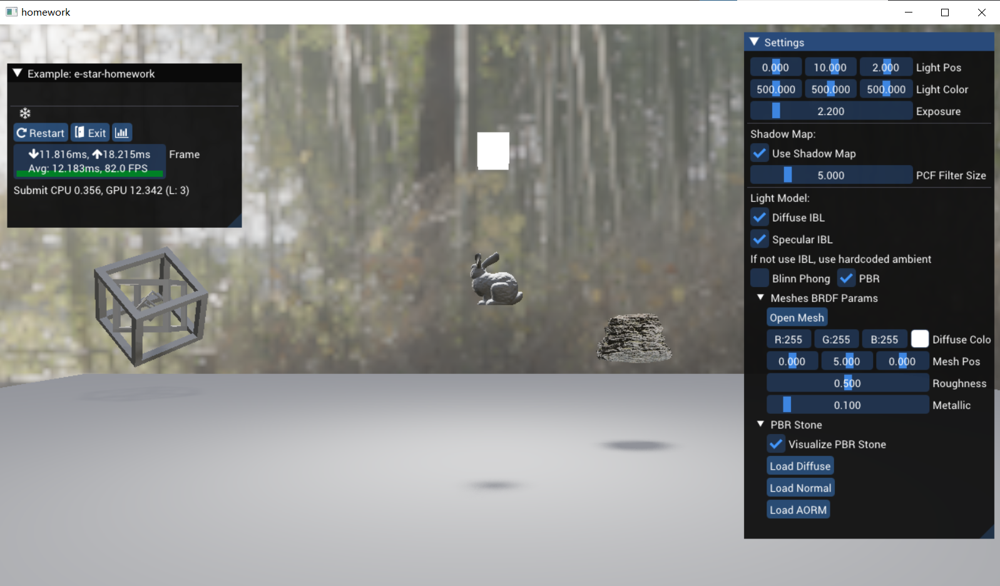
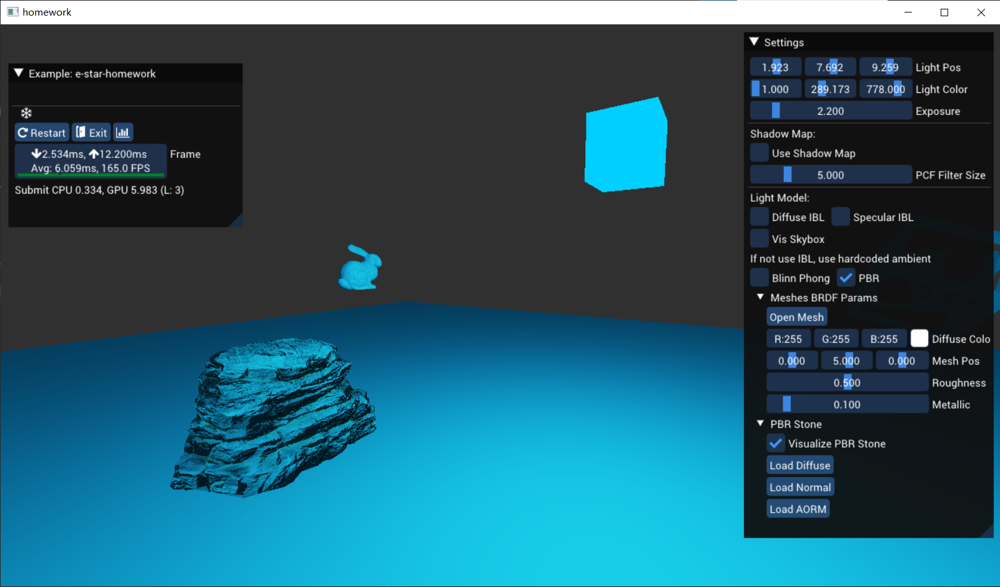
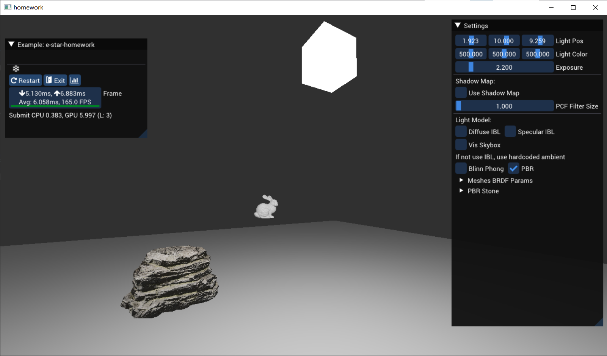
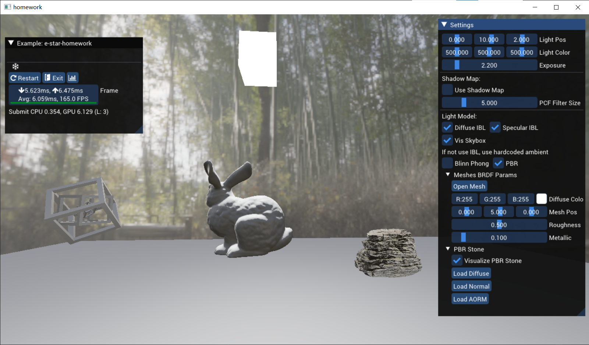
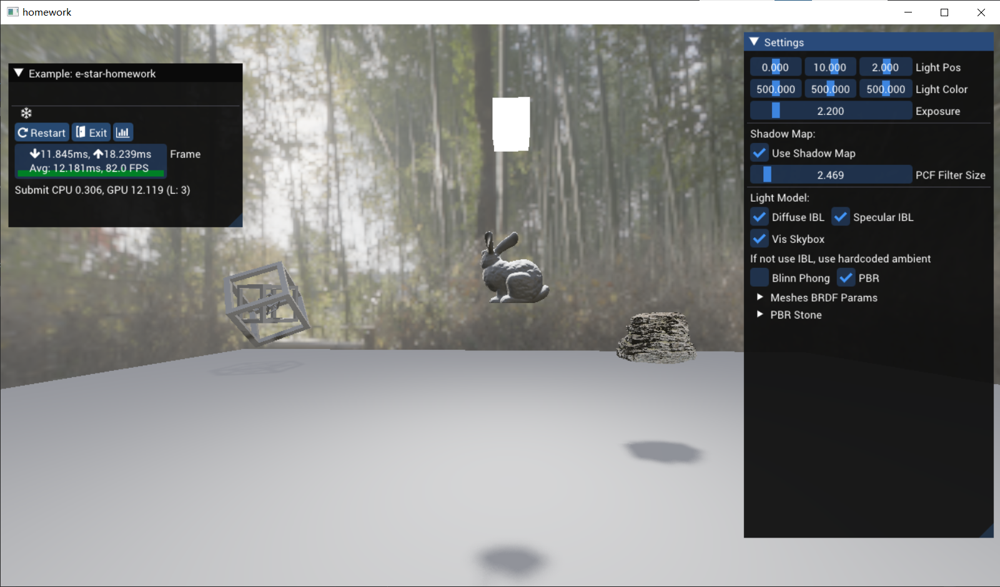

## 09组-张梓添

## 作业完成情况

1. 本次作业使用clion进行代码编写，cmake进行项目管理
2. 已测试使用cmake生成vs工程，vs也可以正常编译运行程序
3. 支持OpenGL、DirectX11两种图形api，可以在homework.cpp第157行修改
4. 已编写cmake，自动编译shaders到两种图形api
5. 已达到5个level需求

## 预览

## 框架功能说明

1.
    1. 可以加载模型，并显示在屏幕上
    2. 点击鼠标左键控制旋转镜头，滚轮缩放镜头

2.
    1. 基础纹理，Blinn-Phong光照
    2. WASD控制镜头上下左右移动
    3. 可以通过滑块调整灯光位置及颜色
       

3.
    1. 从贴图中读取PBR参数
    2. 实现PBR渲染漫反射与镜面反射Stone
    3. 可以点击Load Diffuse, Normal, AORM手动替换PBR Stone贴图
    4. 可以点击切换Blinn Phong与PBR渲染模型
       

4.
    1. IBL漫反射与镜面反射
    2. 渲染天空盒
    3. 可以点击Open Mesh按钮替换兔子为其他模型，并且可以修改位置
    4. 可以点击切换Blinn Phong与PBR渲染模型
    5. 可以手动控制diffuseColor、roughness与metallic参数
       

5.
    1. 实现ShadowMap
    2. HardShadow(PCF filter size = 0)与PCF
    3. 点击开关ShadowMap，可以调整PCF Filter Size
       